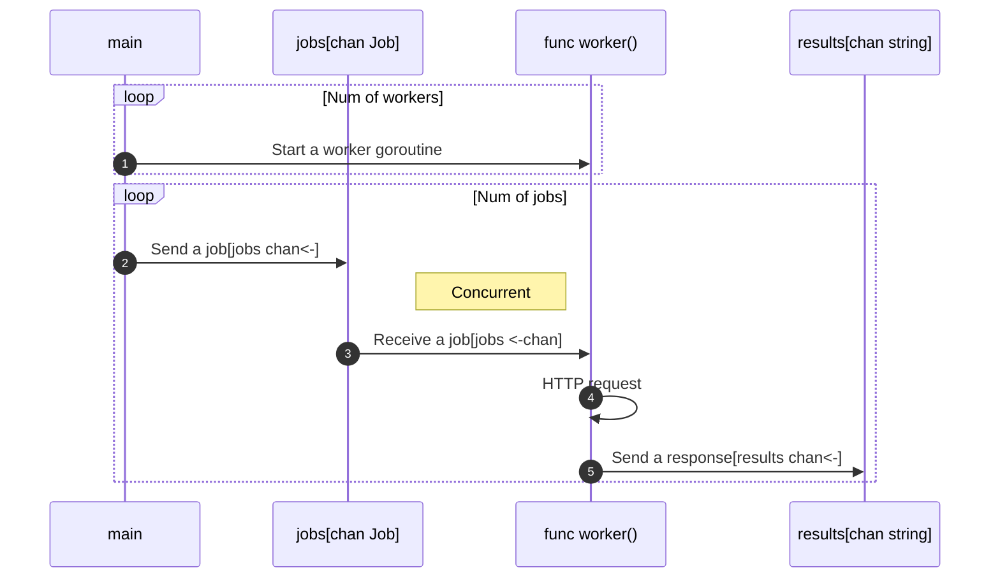

# worker-pools

ワーカープールの実装例。



```bash
go run sandbox/worker-pools/main.go
200: map[ISBN:9780134190440:map[bib_key:ISBN:9780134190440 info_url:https://openlibrary.org/books/OL25925901M/The_Go_Programming_Language preview:noview preview_url:https://openlibrary.org/books/OL25925901M/The_Go_Programming_Language thumbnail_url:https://covers.openlibrary.org/b/id/7427319-S.jpg]]
200: map[ISBN:978-1491941195:map[bib_key:ISBN:978-1491941195 info_url:https://openlibrary.org/books/OL26834447M/Concurrency_in_Go_Tools_and_Techniques_for_Developers preview:noview preview_url:https://openlibrary.org/books/OL26834447M/Concurrency_in_Go_Tools_and_Techniques_for_Developers thumbnail_url:https://covers.openlibrary.org/b/id/8510272-S.jpg]]
200: map[ISBN:0134494164:map[bib_key:ISBN:0134494164 info_url:https://openlibrary.org/books/OL31838215M/Clean_Architecture preview:noview preview_url:https://openlibrary.org/books/OL31838215M/Clean_Architecture]]
```